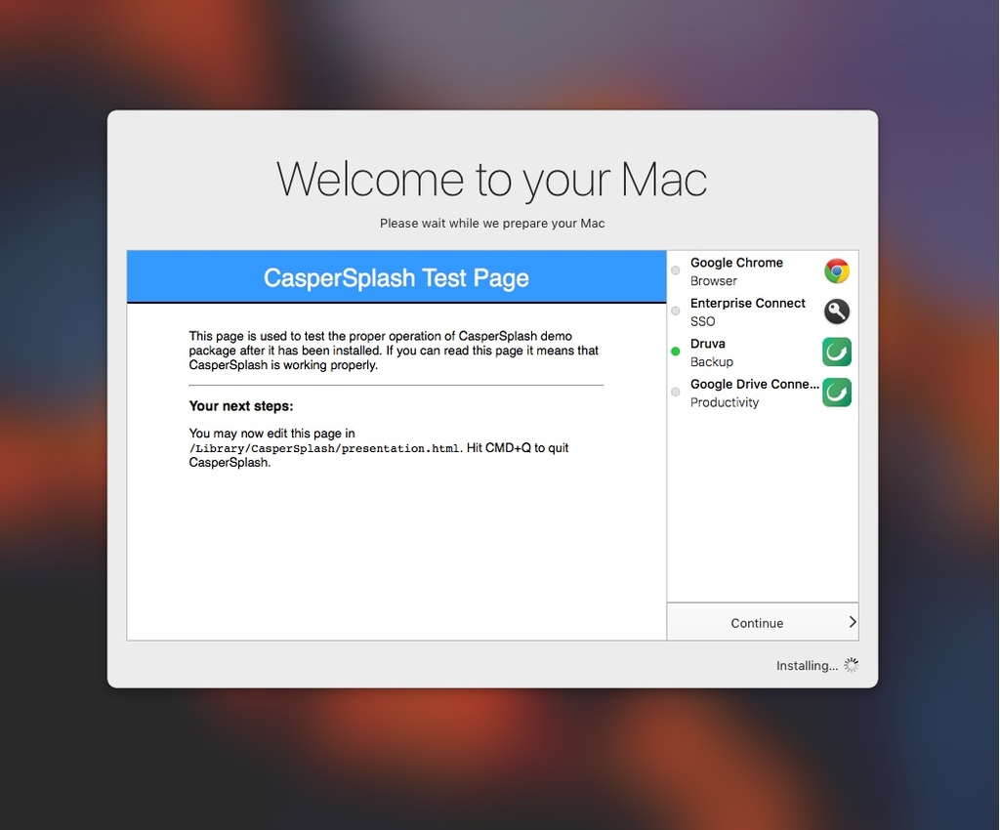

# CasperSplash
**Onboarding splash screen for jamf | Pro with DEP**

The main issue we have with DEP is that it is silent. Some software should be installed before the user starts to use his Mac. 

CasperSplash is a full screen tool that will ask the user to wait while welcoming him, showing some information and which applications are being installed. 

As MacAdmins, it helps us to be more transparent, and it helps our users to feel more in control of their Mac.

## Without CasperSplash

1. Unbox
2. Power on
3. Setup Language, Keymap (eventually network)
4. Enter AD login/password at DEP screen
5. Create a local user (with pre-populated AD credentials)
6. Go through the remaining Setup Assistant screens
7. Desktop appears

At this point the user is puzzled: "What know?". He starts to click around, feeling lost. During that time, the `enrollmentComplete` policies continue executing. Things will popup, Dock will restart, "core" applications will not be available. User experience is affected.

## With CasperSplash

As soon as possible, CasperSplash launches in full screen. 

The user is now shown which components are being installed, with some information on the left of the screen. 

When all critical applications (the minimum set) are installed, the user can click on "Continue". 

His environment is now set up and ready to use.

